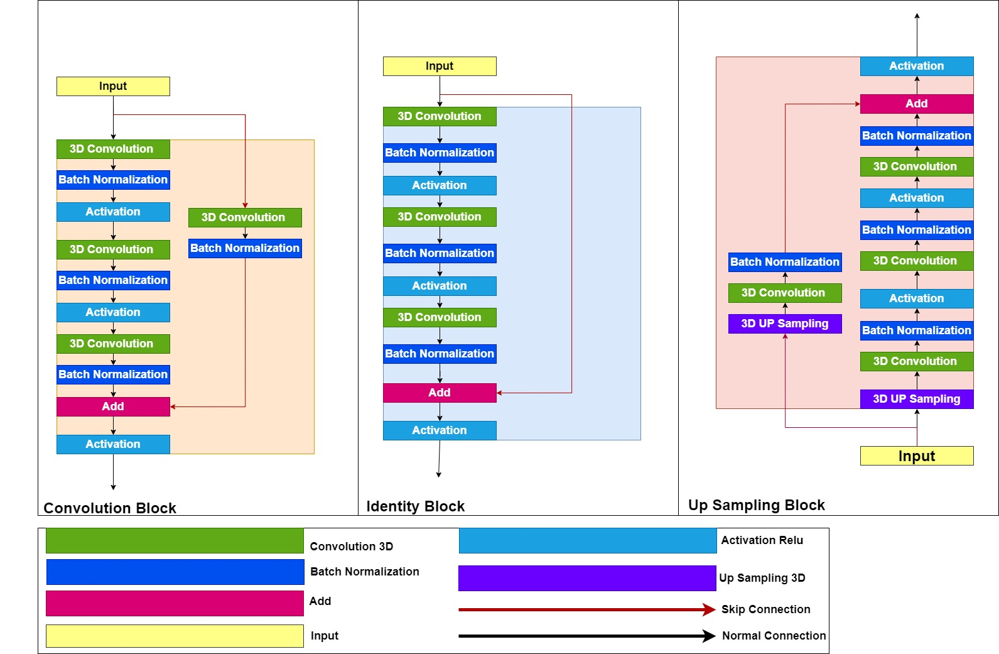
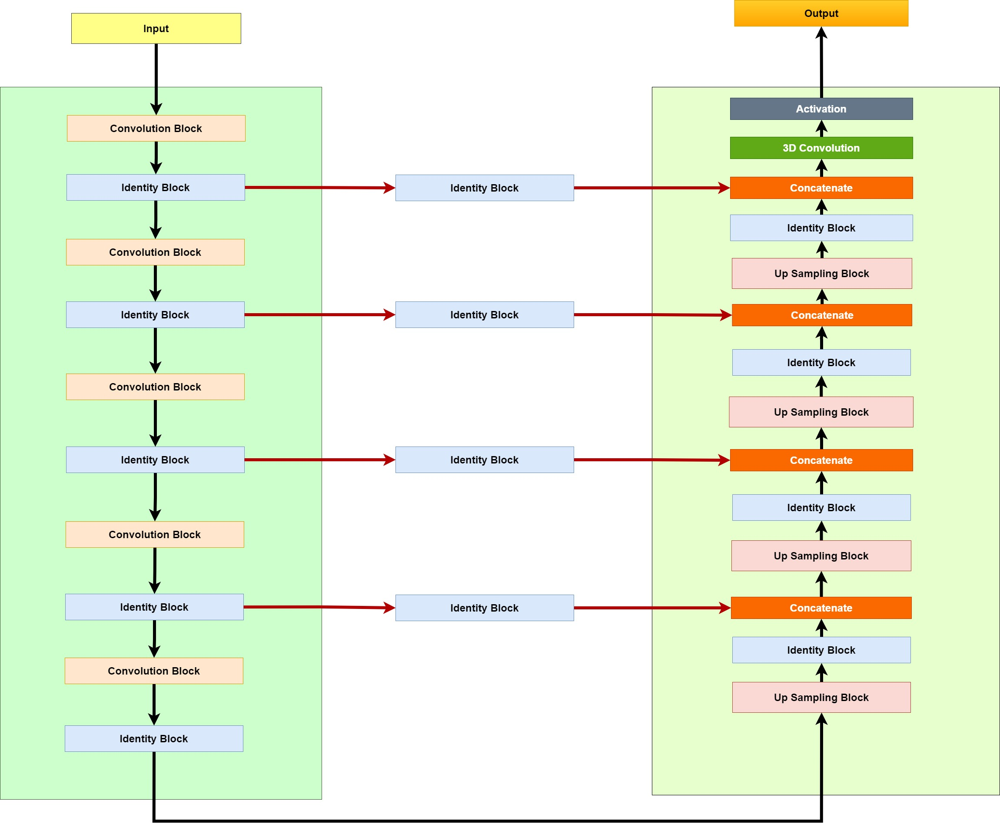

# PUResNet(Predicting protein-ligand binding sites using deep convolutional neural network)
Prediction of protein-ligand binding site is fundamental step in understanding functional characteristics of the protein which plays vital role in carrying out different biological functions and is a crucial stage in drug discovery. A protein shows its true nature after interacting with any capable molecule knows as ligand which binds only in favorable binding site of protein structure.
# Training Dataset 
  scpdb_subset.zip (https://github.com/jivankandel/PUResNet/blob/main/scpdb_subset.zip)
# Independent Dataset 
  coach.zip (https://github.com/jivankandel/PUResNet/blob/main/coach.zip) <br>
  BU48.zip (https://github.com/jivankandel/PUResNet/blob/main/BU48.zip)
# Requirements
1. Tensorflow 1.11 (https://www.tensorflow.org/)
2. Keras (https://keras.io/)
3. Scipy (https://www.scipy.org/)
4. Scikit-Image (https://scikit-image.org/)
5. Open Babel (http://openbabel.org/wiki/Main_Page)
6. Pybel (http://openbabel.org/docs/current/UseTheLibrary/Python_Pybel.html)
7. TFBIO (https://gitlab.com/cheminfIBB/tfbio)
8. Numpy (https://numpy.org/)
9. Python 3.6 (https://www.python.org/)<br>
Note that: It is better to setup new environment using conda or pyenv. You may need to compile open babel and tfbio if installing with PIP doesn't work.
# Model Architecture

<h5 align="center"> Figure showing Convolutional Block,Identiy Block and Up Sampling Block </h5>
<br>

<h5 align="center"> Figure showing Architecture of PUResNet </h5>
<h1>Usage</h1>
1. Clone this repository 
<pre>
git clone https://github.com/jivankandel/PUResNet.git
cd PUResNet
</pre>
2. Setup Environment
<pre>
#create conda environment
conda create -n env_name python=3.6 
conda activate env_name
conda install -c conda-forge openbabel
conda install scikit-image
conda install numpy
conda install -c anaconda scipy
conda install -c conda-forge keras=2.1
conda install -c conda-forge tensorflow=1.11
</pre>

3. Download model file
Go to [this link](https://github.com/jivankandel/PUResNet/blob/main/whole_trained_model1.hdf) and click download, and move it into your working directory. Since this was uploaded with git lfs, git clone won't download the full file.

Please compare sha256 checksum to make sure the file is corrected. 
```
sha256sum whole_trained_model1.hdf
```
Output: `63f3f3321ab6fe58d824518185b821380ee2674369209d025c52489f29c18466`


4. Prediction
<pre>
python predict.py -h
usage: predict.py [-h] --file_format FILE_FORMAT --mode MODE --input_path
                  INPUT_PATH --model_path MODEL_PATH
                  [--output_format OUTPUT_FORMAT] [--output_path OUTPUT_PATH]
                  [--gpu GPU]

optional arguments:
  -h, --help            show this help message and exit
  --file_format FILE_FORMAT, -ftype FILE_FORMAT
                        File Format of Protein Structure like: mol2,pdb..etc.
                        All file format supported by Open Babel is supported
                        (default: None)
  --mode MODE, -m MODE  Mode 0 is for single protein structure. Mode 1 is for
                        multiple protein structure (default: None)
  --input_path INPUT_PATH, -i INPUT_PATH
                        For mode 0 provide absolute or relative path for
                        protein structure. For mode 1 provide absolute or
                        relative path for folder containing protein structure
                        (default: None)
  --model_path MODEL_PATH, -mpath MODEL_PATH
                        Provide models absolute or relative path of model
                        (default: None)
  --output_format OUTPUT_FORMAT, -otype OUTPUT_FORMAT
                        Provide the output format for predicted binding side.
                        All formats supported by Open Babel (default: mol2)
  --output_path OUTPUT_PATH, -o OUTPUT_PATH
                        path to model output (default: output)
  --gpu GPU, -gpu GPU   Provide GPU device if you want to use GPU like: 0 or 1
                        or 2 etc. (default: None)
</pre>
Example:
<pre>
python predict.py -ftype pdb -m 0 -i test.pdb -mpath whole_trained_model1.hdf -otype mol2 -o output -gpu 1
</pre>
